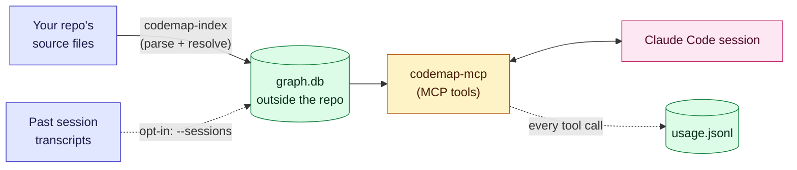

# codegraph

A code graph for [Claude Code](https://claude.com/claude-code), served over MCP.

It parses your repo into a local SQLite graph, so "who calls this", "what
breaks if I change this" and "what did we work out about this last time"
are one lookup instead of a search-and-read loop.

Python, TypeScript/JavaScript, Vue and Go — including `.vue` `<template>`
bindings, where most of a Vue component's methods are actually called
from, and Go function literals, where most of a Go test actually lives.

[](https://github.com/manoranjan14/codemap-mcp/actions/workflows/tests.yml)
[](LICENSE)
[](pyproject.toml)

## Install

```bash
pipx install "codemap-mcp[server,ts]"

codemap-index /path/to/repo
cd /path/to/repo
claude mcp add --scope local codegraph -- codemap-mcp --repo-root /path/to/repo
```

Start Claude Code in that repo and ask it something you'd normally grep
for — *"who calls `useApiClient`?"*, *"what breaks if I change the nav
composable?"*. Nothing is written inside your repo; every index lives
under `~/.codegraph/`.

Re-run `codemap-index` after pulling. It's incremental — well under a
second for a no-op on a 4,000-file repo.

<details>
<summary>Extras, and why there are any</summary>

`pip install codemap-mcp` pulls **zero third-party packages**. The
indexer and query layer use nothing but the standard library (`ast`,
`sqlite3`), and CI asserts that rather than the README claiming it.

| extra | brings | needed for |
|---|---|---|
| `server` | `mcp` | the MCP server — skip it if you only want the CLI |
| `ts` | tree-sitter grammars | TypeScript / JavaScript / Vue. Without it those files are skipped with a warning and Python still indexes in full |

The `ts` extra installs `tree_sitter_languages` on Python ≤3.12 and
`tree-sitter-language-pack` on 3.13+, because no single pack covers all
versions. The newer pack is measurably *worse* at TypeScript — on a real
4,113-file repo it fixes 3 files and breaks 8 — so on 3.13 expect slightly
more files skipped as parse errors. Measurements in
[docs/DESIGN.md](docs/DESIGN.md).

Installing from a checkout instead: `./install.sh` creates
`~/.codegraph/venv` and installs everything into it.

</details>

## What it does that grep doesn't

| | grep / read | codegraph |
|---|---|---|
| Every caller of a function | multi-file search, easy to miss one | `neighbors(symbol, "in")` |
| Blast radius before a change | read and infer by hand | `impacted_by(symbol)` — reverse-reachability |
| What imports this file | grep the path, hope the alias matches | `neighbors("src/lib/db.ts", "in")` |
| A Vue method called only from `<template>` | invisible — it's never called from script | recorded as a call from the template |
| `toRecordAlias<T>(...)` | a `\btoRecordAlias(` pattern misses the generic form | resolved from the AST |
| "What did we learn here?" | nothing persists between sessions | `search_memory` |

That fifth row is not hypothetical. During review, a hand-written grep
baseline missed 4 of 8 real call sites because TypeScript generics defeat
a naive pattern — the graph had all 8.

## Honest about what it doesn't know

This is the part that matters most, and the reason to trust the rest.

- **It refuses to guess.** When a name matches several definitions and
  nothing binds it, the call is recorded as `ambiguous:<name>` **with the
  candidates**, not resolved to a coin-flip. When the target is outside
  the repo it's `external:<name>`. A wrong edge is worse than a missing
  one.
- **A miss tells you whether the index is stale.** Every empty or
  unresolved result carries how many files have changed since the index
  was built, so "this doesn't exist" and "your index predates it" are
  different answers.
- **Truncation is reported.** `truncated: true` with the real `total`,
  never a quiet subset.
- **Type inference is deliberately narrow** — `self`/`this`, constructor
  assignments, field annotations, and `new X().method()`. Not data-flow
  analysis. `get_helper().assist()` stays external, because resolving it
  would require guessing a return type.

## How it works

<div align="center">

<sub>Real output from this repo's own test fixtures.</sub>
</div>



Three layers over one local database:

| Layer | What it is | Tools |
|---|---|---|
| **Code graph** | modules, classes, functions, calls, imports, inheritance | `search_code`, `neighbors`, `impacted_by`, `path_between` |
| **Session memory** | durable notes a session records — why something is shaped a certain way, what broke last time | `add_note`, `search_memory` |
| **Session history** *(opt-in)* | full-text search over past Claude Code transcripts for this repo | `search_sessions`, `list_sessions` |

Indexing is two passes. Pass one parses each changed file and records what
it can resolve locally, plus the references it can't resolve yet — a call,
a base class, an import target, an attribute type. Pass two resolves those
repo-wide in priority order: import binding first, then a same-file match,
then the narrow type-inference pass. Only changed files are re-parsed, and
a file that fails to parse is recorded by content hash so it isn't retried
every run.

## Tools

| Tool | Use for |
|---|---|
| `search(query)` | First stop — symbol plus any notes on it, together |
| `search_code(query)` | Structure only |
| `search_memory(query)` | Notes only |
| `neighbors(symbol, direction, limit)` | What it calls/imports, or what calls/imports it. Pass a **file path** to ask what imports that module |
| `impacted_by(symbol, max_depth, limit)` | Blast radius. Pass a **file path** for route handlers wired up by import rather than called |
| `path_between(a, b)` | How two symbols connect |
| `add_note(note, symbol, ...)` | Record a durable finding |
| `search_sessions(query, role, kind)` | Search past transcripts (opt-in) |
| `list_sessions(limit)` | What history is indexed |

`codemap-usage <repo>` reports whether any of this is actually being
used — calls by tool, found-anything rate, and what share of lookups went
through codegraph rather than grep.

## What's been tested, and what hasn't

Behaviour varies a lot by codebase shape, so this is worth stating plainly.

**Exercised hard:** a 4,113-file Vue 3 + TypeScript frontend, a Node/TS API
service, a Next.js site, the Python standard library (1,439 files), and
gorilla/mux for Go.
Three adversarial review passes against real production code, each
cross-checking results against `grep` ground truth.

**Barely exercised:** Django, Flask, FastAPI, Rails-adjacent layouts,
monorepos, anything over ~5,000 files. The class-body call fix was worth
692 edges on the Python stdlib and **one** edge on the Vue frontend — same
change, two orders of magnitude apart. Expect differences on a shape not
listed above.

**Out of scope by design:** anything spanning repositories. Cross-repo
imports appear as `external:` edges, so you can see which shared packages
a file depends on, but nothing about what flows through them. Data
contracts — DynamoDB shapes, job payloads, queue messages — have no edges
here at all. **A clean `impacted_by` is not evidence that a schema change
is safe.**

## Optional hooks

Two shell helpers ship as commands, for `~/.claude/settings.json`:

```jsonc
// SessionStart (startup|resume), async — keeps the index fresh
"codemap-reindex-if-opted-in \"$CLAUDE_PROJECT_DIR\""

// PostToolUse (Grep|Glob|Bash), async — measures codegraph against grep
"codemap-log-builtin-tool"
```

Both act only on repos that already have an index, so a session started
anywhere else does nothing. The second records tool names only — never
what was searched for.

## Development

```bash
git clone https://github.com/manoranjan14/codemap-mcp && cd codemap-mcp
pip install -e ".[dev]"
pytest
```

301 tests across Python 3.10–3.13, with and without the optional
tree-sitter dependency.

**[docs/DESIGN.md](docs/DESIGN.md)** is the full engineering record: every
decision with the measurement behind it, every bug found by review with
its reproduction, and the things deliberately left undone. Names in it are
anonymised; the numbers are real.

## License

MIT
